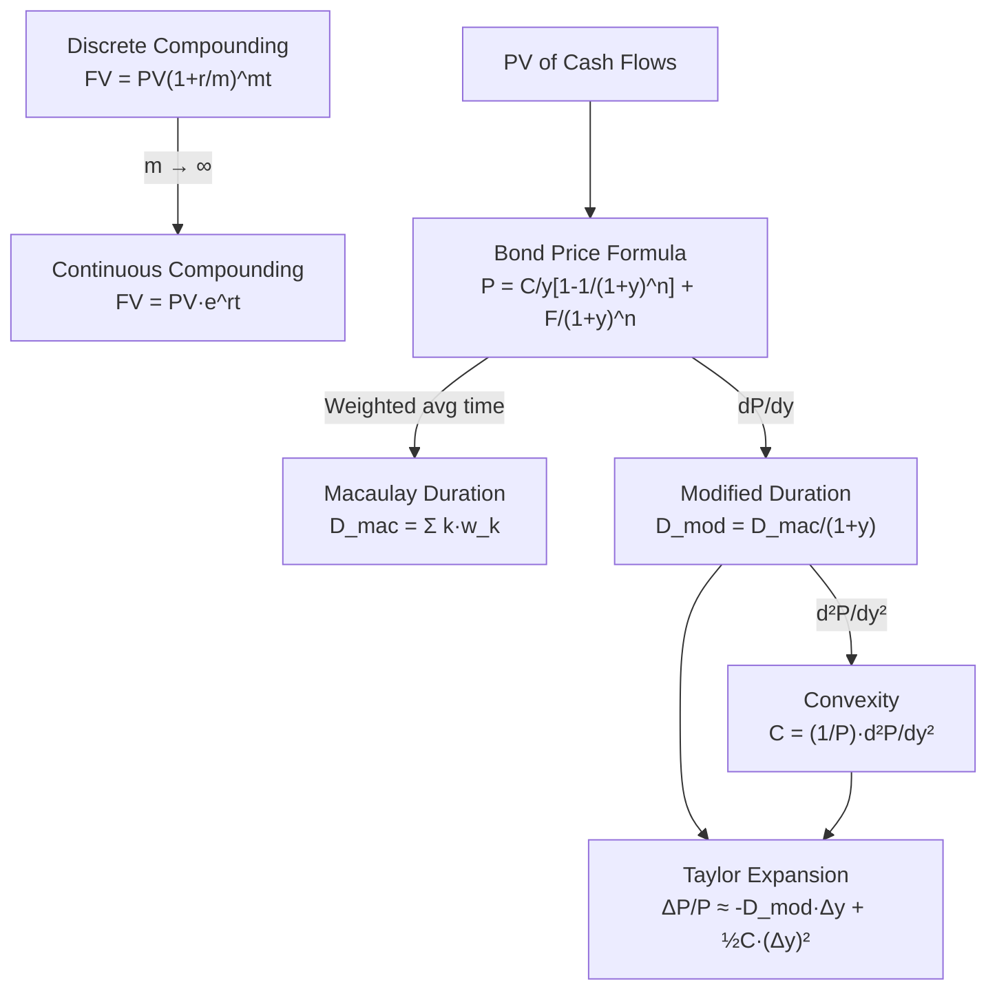

# D01 — Bond Math Derivations

> **Lecture 1 · MIT 18.642**
> Every formula here is built from scratch — no result is dropped in without proof.
> Read the English paragraph first; the algebra is just a translation of that idea into symbols.

---

## 1. Why Continuous Compounding Converges to $e^{rt}$

### The Starting Point — Discrete Compounding

Imagine you invest $PV$ dollars at an annual rate $r$, and the bank compounds your interest $m$ times per year. Each compounding period you earn $r/m$ on whatever balance you have.

After one period your balance is $PV \cdot (1 + r/m)$. After two periods it's $PV \cdot (1 + r/m)^2$. After $t$ years ($mt$ total periods):

$$
FV = PV \left(1 + \frac{r}{m}\right)^{mt}
$$

### What Happens as We Compound More and More Often?

Now ask: what if the bank compounds every second? Every nanosecond? In the limit, $m \to \infty$ — this is **continuous compounding**.

We need to evaluate:

$$
\lim_{m \to \infty} PV \left(1 + \frac{r}{m}\right)^{mt}
$$

$PV$ is just a constant multiplier, so we can focus on the growth factor alone:

$$
\lim_{m \to \infty} \left(1 + \frac{r}{m}\right)^{mt}
$$

### Step 1 — Substitution

Let $n = m / r$, so $m = nr$ and $r/m = 1/n$. As $m \to \infty$, we also have $n \to \infty$.

$$
\left(1 + \frac{1}{n}\right)^{nrt}
$$

### Step 2 — Recognise the Definition of $e$

Recall the foundational limit from calculus:

$$
e = \lim_{n \to \infty} \left(1 + \frac{1}{n}\right)^{n}
$$

Our expression is $\left[\left(1 + \frac{1}{n}\right)^{n}\right]^{rt}$, which is just $e$ raised to the power $rt$:

$$
\lim_{n \to \infty} \left(1 + \frac{1}{n}\right)^{nrt}
= \left[\lim_{n \to \infty} \left(1 + \frac{1}{n}\right)^{n}\right]^{rt}
= e^{rt}
$$

### Step 3 — Final Result

Putting the $PV$ back:

$$
\boxed{FV = PV \cdot e^{rt}}
$$

> **Intuition check:** The number $e \approx 2.71828$ is the natural "speed limit" of compounding. No matter how often you compound, you can never grow faster than $e^{rt}$. It's the ceiling that discrete compounding approaches from below.

---

## 2. Deriving the Bond Pricing Formula

### The Principle — Price Equals Present Value of All Future Cash Flows

A bond is just a bundle of promises: "I'll pay you $C$ dollars every period, and at the end I'll also return the face value $F$." To find what that bundle is worth *today*, we discount each promise back to the present.

Let:
- $C$ = coupon payment per period
- $F$ = face (par) value
- $y$ = yield per period (the discount rate)
- $n$ = total number of coupon periods

### Step 1 — Write Out Every Cash Flow

| Time | Cash Flow |
|------|-----------|
| 1    | $C$       |
| 2    | $C$       |
| …    | …         |
| $n$  | $C + F$   |

The price is the sum of all discounted cash flows:

$$
P = \frac{C}{(1+y)^1} + \frac{C}{(1+y)^2} + \cdots + \frac{C}{(1+y)^n} + \frac{F}{(1+y)^n}
$$

Separate the coupons from the face value repayment:

$$
P = \sum_{k=1}^{n} \frac{C}{(1+y)^k} \;+\; \frac{F}{(1+y)^n}
$$

### Step 2 — The Coupon Sum Is a Geometric Series

The coupon sum is $C$ times a geometric series with first term $a = 1/(1+y)$ and common ratio $r = 1/(1+y)$:

$$
\sum_{k=1}^{n} \frac{1}{(1+y)^k}
= \frac{a(1 - r^n)}{1 - r}
= \frac{\frac{1}{1+y}\left(1 - \frac{1}{(1+y)^n}\right)}{1 - \frac{1}{1+y}}
$$

### Step 3 — Simplify the Denominator

$$
1 - \frac{1}{1+y} = \frac{(1+y) - 1}{1+y} = \frac{y}{1+y}
$$

### Step 4 — Cancel and Simplify

$$
\frac{\frac{1}{1+y}\left(1 - \frac{1}{(1+y)^n}\right)}{\frac{y}{1+y}}
= \frac{1}{1+y} \cdot \frac{1+y}{y} \cdot \left(1 - \frac{1}{(1+y)^n}\right)
= \frac{1}{y}\left(1 - \frac{1}{(1+y)^n}\right)
$$

### Step 5 — Assemble the Final Formula

Multiply by $C$ and add back the face value term:

$$
\boxed{P = \frac{C}{y}\left[1 - \frac{1}{(1+y)^n}\right] + \frac{F}{(1+y)^n}}
$$

### Anatomy of the Formula

| Term | Name | What It Represents |
|------|------|--------------------|
| $\frac{C}{y}\left[1 - \frac{1}{(1+y)^n}\right]$ | **Annuity Factor** | PV of the stream of coupon payments — as if they went on forever, minus the part beyond maturity |
| $\frac{F}{(1+y)^n}$ | **Discount Factor** | PV of the single lump-sum repayment of face value at maturity |

> **Intuition check:** The first term is the value of the "coupon annuity." The factor $C/y$ would be the value if coupons lasted forever (a perpetuity). We subtract $C/y \cdot (1+y)^{-n}$ because the coupons actually stop at time $n$.

---

## 3. Deriving Macaulay Duration

### The Idea — A Weighted Average of "When You Get Paid"

You receive cash flows at different times. Some arrive early, some late. Duration asks: **on average, when does your money arrive?** "Average" here means weighted by the present value of each cash flow — a large payment matters more than a small one.

### Step 1 — Define the Weights

The present value of the cash flow at time $k$ is:

$$
PV(CF_k) = \frac{CF_k}{(1+y)^k}
$$

The bond's total price is the sum of all these:

$$
P = \sum_{k=1}^{n} \frac{CF_k}{(1+y)^k}
$$

The weight assigned to time $k$ is the fraction of the total price attributable to that cash flow:

$$
w_k = \frac{PV(CF_k)}{P} = \frac{CF_k / (1+y)^k}{P}
$$

Note that these weights sum to 1 (they're fractions of the whole), so this is a proper weighted average:

$$
\sum_{k=1}^{n} w_k = \frac{1}{P}\sum_{k=1}^{n}\frac{CF_k}{(1+y)^k} = \frac{P}{P} = 1
$$

### Step 2 — The Macaulay Duration Formula

The weighted average time to receipt is:

$$
\boxed{D_{\text{mac}} = \sum_{k=1}^{n} k \cdot w_k = \frac{1}{P}\sum_{k=1}^{n} \frac{k \cdot CF_k}{(1+y)^k}}
$$

Each time index $k$ is weighted by how much of the bond's value arrives at that moment.

### Step 3 — Special Case: Zero-Coupon Bond

A zero-coupon bond has exactly **one** cash flow — the face value $F$ paid at maturity $n$. There's nothing else:

$$
D_{\text{mac}} = \frac{1}{P} \cdot \frac{n \cdot F}{(1+y)^n}
$$

But the price of a zero-coupon bond *is* $P = F/(1+y)^n$, so:

$$
D_{\text{mac}} = \frac{1}{\frac{F}{(1+y)^n}} \cdot \frac{n \cdot F}{(1+y)^n} = \frac{(1+y)^n}{F} \cdot \frac{n \cdot F}{(1+y)^n} = n
$$

$$
\boxed{D_{\text{mac}}^{\text{zero}} = n = \text{Maturity}}
$$

> **Intuition check:** If all your money arrives at one single moment, then the "average arrival time" is obviously that moment. That's why a zero-coupon bond's duration equals its maturity — there's no other cash flow to pull the average earlier.

---

## 4. Deriving Modified Duration from the Price-Yield Relationship

### The Goal — Measure Price Sensitivity to Yield Changes

We want to know: if the yield moves by a tiny amount $dy$, how much does the bond price change? This is a calculus question — we need $dP/dy$.

### Step 1 — Start from the Price Expression

$$
P = \sum_{k=1}^{n} \frac{CF_k}{(1+y)^k}
$$

Each term is of the form $CF_k \cdot (1+y)^{-k}$.

### Step 2 — Differentiate with Respect to $y$

Using the power rule, $\frac{d}{dy}(1+y)^{-k} = -k(1+y)^{-k-1}$:

$$
\frac{dP}{dy} = \sum_{k=1}^{n} CF_k \cdot \left[-k(1+y)^{-k-1}\right]
= -\sum_{k=1}^{n} \frac{k \cdot CF_k}{(1+y)^{k+1}}
$$

### Step 3 — Factor Out $1/(1+y)$

Notice each term has $(1+y)^{k+1}$ in the denominator. We can split this as $(1+y)^k \cdot (1+y)$:

$$
\frac{dP}{dy} = -\frac{1}{1+y}\sum_{k=1}^{n} \frac{k \cdot CF_k}{(1+y)^k}
$$

### Step 4 — Recognise Macaulay Duration

That sum is exactly $P \cdot D_{\text{mac}}$ (from our derivation in Section 3):

$$
\sum_{k=1}^{n} \frac{k \cdot CF_k}{(1+y)^k} = P \cdot D_{\text{mac}}
$$

So:

$$
\frac{dP}{dy} = -\frac{1}{1+y} \cdot P \cdot D_{\text{mac}}
$$

### Step 5 — Define Modified Duration

Rearranging to get the **percentage** price change per unit yield change:

$$
\frac{1}{P}\frac{dP}{dy} = -\frac{D_{\text{mac}}}{1+y}
$$

We define **Modified Duration** as the magnitude of this sensitivity:

$$
\boxed{D_{\text{mod}} = \frac{D_{\text{mac}}}{1+y}}
$$

So the price-yield relationship can be written compactly as:

$$
\frac{dP}{P} \approx -D_{\text{mod}} \cdot dy
$$

> **Intuition check:** Modified duration tells you: "For every 1% rise in yield, the bond price falls by approximately $D_{\text{mod}}$%." It's Macaulay duration adjusted for the compounding effect — dividing by $(1+y)$ converts from "per period" weighting to a true instantaneous sensitivity.

---

## 5. Deriving Convexity as the Second Derivative

### Why We Need a Second-Order Term

Modified duration gives us a linear approximation of how price changes with yield. But price-yield curves are **curved** (convex), not straight. For larger yield changes, the linear estimate misses. The second derivative — **convexity** — captures that curvature.

### Step 1 — Take the Second Derivative

We already found:

$$
\frac{dP}{dy} = -\sum_{k=1}^{n} \frac{k \cdot CF_k}{(1+y)^{k+1}}
$$

Differentiate again:

$$
\frac{d^2P}{dy^2} = -\sum_{k=1}^{n} k \cdot CF_k \cdot \frac{d}{dy}\left[(1+y)^{-(k+1)}\right]
$$

Applying the power rule, $\frac{d}{dy}(1+y)^{-(k+1)} = -(k+1)(1+y)^{-(k+2)}$:

$$
\frac{d^2P}{dy^2} = -\sum_{k=1}^{n} k \cdot CF_k \cdot \left[-(k+1)(1+y)^{-(k+2)}\right]
$$

$$
\frac{d^2P}{dy^2} = \sum_{k=1}^{n} \frac{k(k+1) \cdot CF_k}{(1+y)^{k+2}}
$$

### Step 2 — Define Convexity

Convexity is the second derivative scaled by the price:

$$
\boxed{\text{Convexity} = \frac{1}{P}\frac{d^2P}{dy^2} = \frac{1}{P}\sum_{k=1}^{n}\frac{k(k+1) \cdot CF_k}{(1+y)^{k+2}}}
$$

### Step 3 — Build the Full Taylor Expansion

Recall the Taylor series for a function $P(y)$ around the current yield $y_0$:

$$
P(y_0 + \Delta y) \approx P(y_0) + \frac{dP}{dy}\Delta y + \frac{1}{2}\frac{d^2P}{dy^2}(\Delta y)^2
$$

Subtract $P(y_0)$ from both sides and divide by $P$:

$$
\frac{\Delta P}{P} \approx \frac{1}{P}\frac{dP}{dy}\Delta y + \frac{1}{2}\cdot\frac{1}{P}\frac{d^2P}{dy^2}(\Delta y)^2
$$

Substitute our definitions of Modified Duration and Convexity:

$$
\boxed{\frac{\Delta P}{P} \approx -D_{\text{mod}} \cdot \Delta y \;+\; \frac{1}{2}\cdot C_{\text{convexity}} \cdot (\Delta y)^2}
$$

### The Two Terms, Explained

| Term | Role |
|------|------|
| $-D_{\text{mod}} \cdot \Delta y$ | **First-order (linear)** — the slope of the price-yield curve. Always pulls price down when yields rise. |
| $\frac{1}{2} C \cdot (\Delta y)^2$ | **Second-order (curvature)** — always **positive** for plain bonds. This is the "convexity bonus": whether yields go up or down, convexity adds value. |

> **Intuition check:** Think of rolling a ball along a curved hill. Duration tells you the slope — which way and how fast the ball starts rolling. Convexity tells you the shape of the hill — whether it flattens out (slowing the ball) or curves further (accelerating it). A bond with higher convexity benefits more from yield volatility because the price gains from falling yields are larger than the price losses from rising yields.

---

## Summary — Derivation Map

> Each derivation builds on the one before it. Master them in order and you'll own the entire analytical framework for fixed-income pricing.
